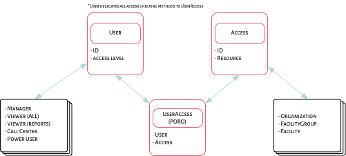
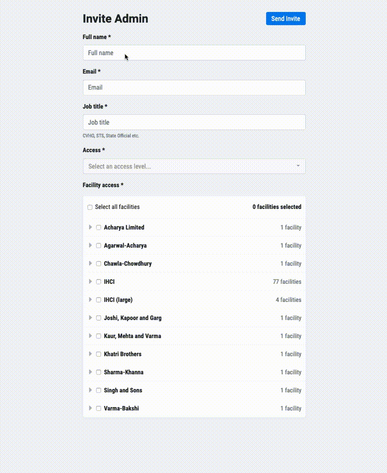

# Simplified User Permissions

## Context
We are currently using a permission-based access control mechanism with a large 
number of permissions, to emulate the following _roles_:

- Owner
- Organization Owner
- Supervisor
- Analyst
- Counsellor

We've found this permission based mechanism hard to maintain due to a few reasons:

- The _roles_ are basically presets of permissions, and modifying the preset for a role also requires 
a corresponding data migration to update the permissions of existing users.
- It allows _custom_ roles, where a given user can have a list of permissions that don't conform to any of the defined presets. This can be problematic when adding new permissions to the system, since it isn't easy to decide if the _custom_ user should get the new permission or not.
- The specific implementation of our permission-based system also added a fair amount of indirection and cognitive overhead which lead to a suboptimal developer experience.

Generally, we also discovered that we don't actually need this level of flexibility in our access control model, since most of our users have very normalised usage patterns. This is something we envisaged [previously](010-user-permissions.md), where arbitrary permutations at a finer-grain were possible; over time, we have realized that it is not necessary.

## Decision
We will move to a [Role Based Access Control](https://en.wikipedia.org/wiki/Role-based_access_control) system with the following roles to start with:

| Role                               | Description                                                                                                                    |
|------------------------------------|--------------------------------------------------------------------------------------------------------------------------------|
| Manager                            | full access to data and have permissions to manage other users and resources within the  resources where they have access      |
| Viewer (all data)                  | full access to data (including PII) within the resources where they have access                                                |
| Viewer (reports only)              | access to reports within the resources where they have access                                                                  |
| Call Center (manage overdue lists) | can manage the overdue list within the resources where they have access                                                        |
| Power User                         | full access to data, and user and resource management options in a given  deployment of the application                        |

### Model

The general architecture is the following,



- `User` is an existing model.
- `Access` will hold all the accesses for the `User`.
- `UserAccess` will drive the behaviour between the two.

The `resource` property on `Access` can be an instance of one of the following: `Organization`, `FacilityGroup`, `Facility`, but may include other regions like blocks, districts, states etc. in the future.

**Note**: These accesses will only apply to users with an `EmailAuthentication` (as those are all the dashboard users).


### API

All access-related APIs will be encapsulated in the `UserAccess` model. It should ideally remain this way in the future, so that there's a single interface to use throughout the app.

As a part of the API, we will add a concept of `actions`, that allows to bunch together roles into the kind of action they can perform. This allows us to grow our roles easily without needing to update the call-sites throughout the codebase.

| Action              | Role(s)                                           |
|---------------------|---------------------------------------------------|
| Manage              | Manager                                           |
| View PII            | Manager, Viewer (all data)                        |
| View Reports        | Manager, Viewer (all data), Viewer (reports only) |
| Manage Overdue List | Manager, Viewer (all data), Call Center           |

The most common API for scoping the data one can access for a kind of resource, will follow this pattern,

```ruby
current_user.accessible_<pluralized_resource_name>(action)
```

Some examples,


```ruby
current_user.accessible_organizations(:manage)
current_user.accessible_organizations(:view_pii)
current_user.accessible_facility_groups(:manage)
current_user.accessible_facilities(:manage)
current_user.accessible_facilities(:manage_overdue)
```

From this, it's fairly easy to build out general-purpose authorization checks if necessary; like,

```ruby
# eg., don't show a page if you don't have access to any organizations
current_user.accessible_organizations(:manage).any? 
```

This is just a peek into the basic API, it will grow and evolve naturally as necessary.

### Interface

The interface to edit or add new users will fundamentally be a tree-driven selection screen where you can adjust the granularity of access to the currently available resources. 




### Cascading access

Access on these resources will always cascade downwards. That is, access to an organization implies access to all facility groups and facilities within the organization; access to a facility group implies access to all facilities in that group, and so on.


### Future

Once [Regions](013-regions.md) have a more concrete presence in our app, we can link the `resource` to be a genuine `Region`.


### Non-goals

- Authentication
- Authorization for the Sync APIs


## Status
Accepted

## Consequences

- We no longer support customized permissions outside these defined roles. 
- The granularity of access in which our roles operate is a lot larger, for simplicity.
- We do not use the [pundit](https://github.com/varvet/pundit) gem for managing authorization anymore.
