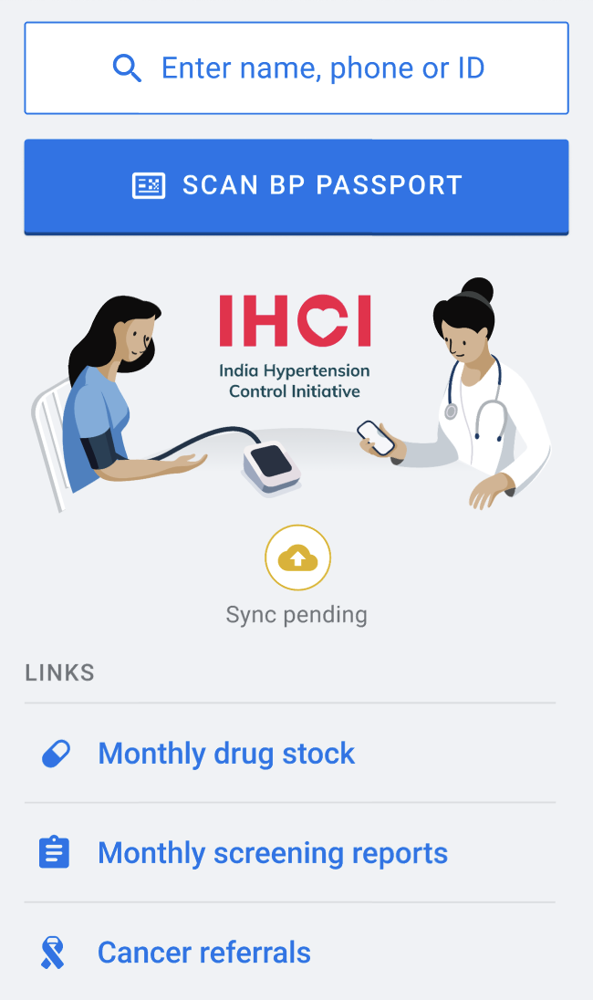
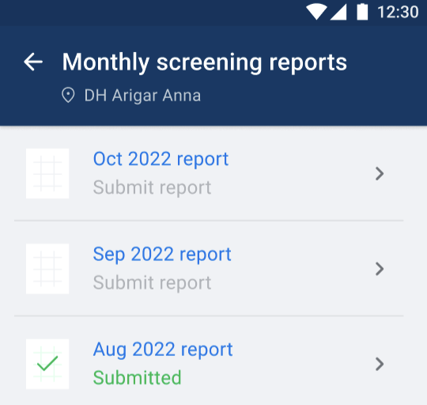
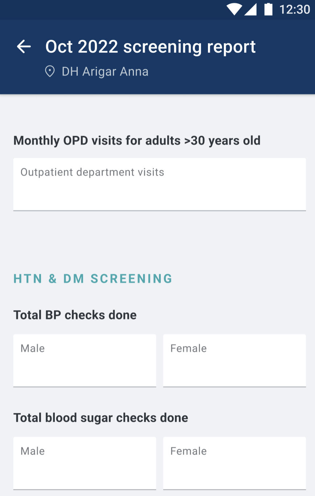

# Questionnaires (AKA Dynamic Forms)

## Status
Accepted

## Context

Historically, a "form" at Simple has been static and designed as a first-class entity. For example, Blood Pressure has it's own API, database and a static UI on mobile. The challenge with static forms has been high time to production and inflexible UI. A new form demands a new API, table and UI development on mobile. Modifications to an existing form demands a version upgrade of the API and mobile app.

Static forms have served us well for infrequently changing forms like Blood Pressure and Blood Sugar. For forms that require frequent changes (like Drug-stock), we used WebView to accommodate the dynamic nature of this form. WebView isn't offline-first, like the rest of Simple app.

Questionnaires (aka Dynamic forms) is an effort at solving 2 challenges in an offline-first manner: reducing time to production; and flexibility to add/remove fields without need to update the Simple app. We also refer to them as Server-driven UI.

## Decision

We have designed Questionnaires by reusing underlying offline-first sync architecture of Simple. Definitions of new terminology introduced:
- **Form:** A document to gather information in a structured manner.
- **Questionnaire:** A sync resource containing form's layout and input fields, version and form-type.
- **Questionnaire Response:** A sync resource containing a user's inputs for a form, the user who recorded the response and the facility the input was recorded at.
- **Layout:** The layout of a form defined in terms of a custom DSL that helps mobile in rendering the form as defined by the server.

## Implementation Details

Questionnaires are implemented by following below mentioned steps:

### 1. Mobile _syncs_ questionnaires from server to device
Mobile requests questionnaires from server using [the questionnaire sync API](https://api.simple.org/api-docs/index.html#tag/Questionnaires). Server responds with all layouts compatible with the DSL version supported by the mobile app.

On Mobile database, the primary key for Questionnaires sync resource is `questionnaire_type`, and not `id`. _That is a key difference between Questionnaires and other sync resources._ This is because mobile needs only 1 layout per questionnaire type. Whenever a new questionnaire of an existing type is created on Server-side, server sends the updated ID and layout in the sync response, and mobile updates the row for corresponding type.

| questionnaire_type (PK) | id     | layout   |
|-------------------------|--------|----------|
| screening_reports       | uuid-1 | {form-1} |
| supplies_reports        | uuid-2 | {form-2} |

### 2. Mobile _syncs_ questionnaire_responses from server to device
User inputs for a dynamic form are stored in a questionnaire response. Mobile requests questionnaire response sync resources from the server using [this sync API](https://api.simple.org/api-docs/index.html#tag/Questionnaire-Responses). These responses serve as data for user to create, view or update.

Other sync resources have explicit keys for recording input (Blood Pressures have "systolic"/"diastolic", Patients have "gender", etc.). Questionnaire response records input in a single field `content` of JSON data type.

| id      | questionnaire_id | questionnaire_type | facility_id | user_id | content                           |
|---------|------------------|--------------------|-------------|---------|-----------------------------------|
| uuid-11 | uuid-1           | screening_reports  | Surat       | 123     | ```{"name": "john", "age": 30}``` |
| uuid-22 | uuid-2           | drug_stock_reports | Bangalore   | 456     | ```{"name": "doe", "age": 40}```  |

### 3. Displaying questionnaires on home page


The decision to display or hide link to a dynamic form on the home page is based on 3 criteria, all of which must be met:
1. Mobile has a questionnaire of given type.
1. Mobile has questionnaire responses for given type.
1. Config for a questionnaire type enabled for User's facility, which mobile derives from the facility sync API.
    1. *Note: This config is a field in facilities table, and not a flipper flag.*

### 4. Displaying the list of responses for a questionnaire type


When user clicks on a form type from home page, Mobile queries its table for responses of given questionnaire type. Mobile has some custom logic on ordering and style of the forms:
1. Mobile orders forms in descending order of months by checking for `content["month_date"]` key.
1. Mobile deduces submission status by checking for `content["submitted"]` key.
1. Mobile localizes `month_date` before displaying them.
1. To maintain backward/forward compatibility of a response when new questionnaire layouts are released (more details in FAQ section below), all keys inside a content are meant to be treated as optional. However, for monthly reports, `month_date` & `submitted` keys are _mandatory_ for mobile app to display them. If Mobile cannot find these keys in a questionnaire response, it will crash.
1. Mobile has display & translation logic for these mandatory fields.

### 5. User clicks on a form


When user clicks on a form, Mobile renders UI of a questionnaire based on the layout. Current version of DSL has provisions for `integer, string, date & radio-button` input types, and `header/sub-header/paragraph/checklist` display types; and can be extended to more types in future.

### 6. User submits a form
When user submits a form, Mobile updates the `content`, `questionnaire_id`(to record the layout which was displayed to a user), `last_updated_by_user_id` & `facility_id` for a questionnaire response.

A questionnaire's layout uses `link_id`s to represent input fields. Mobile uses them to display values in UI and record responses in the `content` key. 
A specimen `content` key's value looks like:
```json
{
  "submitted": true,
  "month_date": "08-2023",
  "monthly_screening_report.total_bp_checks.male": 10,
  "monthly_screening_report.comments": "All good"
}
```

### 7. Handling conflicts when syncing from device to server
When server receives different questionnaire_responses for the same ID, it merges the 2 records in the following way:
1. Latest `device_updated_at` takes precedence for every field, except `content`.
1. A UNION of existing & new `content` is taken.
1. For conflicting keys within `content`, latest update takes precedence.
1. Consider this specimen workflow:
    1. User #1 fills keys A, B, C & D on 6 Dec
    1. User #2 fills keys C, D, E & F on 7 Dec
    1. Post union, DB will contain keys A, B, C, D, E & F
    1. C, D will be User #2’s data.

### 8. User changes locale

For most screens, mobile stores the translations for all languages. Since a questionnaire's layout is driven by server, translations are also stored on server-side. When user changes a locale, a sync gets triggered on mobile. We leverage this behaviour of mobile to communicate layouts with new translations from server to mobile. 

In addition to the usual keys, we're storing the user's locale inside Questionnaire sync resource's `process_token`. Unlike other sync resources, where a region change triggers a `force_resync`, in case of questionnaires, a locale change triggers a `force_resync`. 

> **Note:** When user changes locale, Mobile does not invalidate the questionnaire table on the device. The app will render questionnaires with older locale until sync is done fetching newer translations.  

### 9. Other features and points of note

1. Dynamic forms are backward & forward compatible
    - When a new questionnaire version is released, the app can continue to work with responses of previous version.
    - Apps with older version of questionnaire can also parse responses of newer version.
    - For maintaining this forward/backward compatibility, there are no _mandatory_ fields in a questionnaire response. All fields are optional.
    - When Mobile receives a response that was recorded against a different version of a questionnaire, it handles `content` key in following manner:
      - Extra keys are ignored when displaying the form.
      - Missing keys are added to `content` when recording user input.
1. For a questionnaire, a response can be initialized either on Server or Mobile side.
    - Monthly forms that are exclusive per facility are initialized on Server-side (example: Screening, Supplies & Drug-stock reports).
    - Forms that require enrolling fresh data are inialized on Mobile-side (example: cancer-referral forms).
1. Mobile uses [Jetpack Compose](https://developer.android.com/jetpack/compose) for rendering the layouts dynamically.

For configuring questionnaires from Server-side, refer to [this how-to guide](https://github.com/simpledotorg/simple-server/blob/master/doc/howto/configuring_questionnaires.md).

## Avoided Designs

- We are not using FHIR questionnaires for following reasons:
  - They're too generic/extensible for our use-case.
  - The libraries supporting them aren't quite mature yet.
- We are not using XForms as the DSL for following reasons:
  - They have a steep learning curve and documentation/ecosystem isn’t developer friendly yet.
  - The [XForms specification](https://www.w3.org/TR/xforms20) is a lot to parse through. Ruby only has a single gem which lacks documentation ([sample XForm](https://bitbucket.org/instedd/ruby-xforms/src/master/spec/data/xform1.xml), [sample usage](https://bitbucket.org/instedd/ruby-xforms/src/master/spec/form_spec.rb)).
  - Rendering & parsing XML in the mobile app is complex (references: [ODK’s forum reply](https://forum.getodk.org/t/using-xform-in-the-mobile-app/16262/2)). We’ll have to use the [JavaRosa library](https://github.com/getodk/javarosa) for this.
- We aren't storing dynamic forms in YAML, because:
  - We want to support different forms per-country. In the future, we would like to support scoping, access control and modifying forms from the dashboard.
  - Storing forms in the DB allows us to do all of these things.
