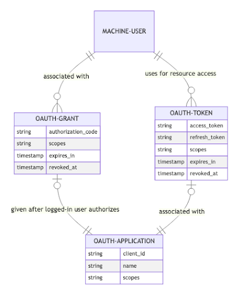

# Use OAuth for external Simple clients
## Context

Simple has always been a software with a client and server for 
[syncing](001-synchronization.md) that was maintained by the Simple team. There
are other client applications from Bangladesh that want to sync their data to 
the Simple Server for [reporting](004-reporting.md), much like the Simple App
does. This calls for building a robust authorization mechanism so that we can 
ensure that the client has valid authority to carry out various actions 
like fetching or sending health records.

We require an authorization mechanism that's easy for external clients to adopt
and low maintenance for us.

## Decision

We will use the OAuth 2.0 framework to allow external clients to integrate with
the Simple Server. [Doorkeeper](https://github.com/doorkeeper-gem/doorkeeper/wiki)
will be used to implement an
[authorization server](https://datatracker.ietf.org/doc/html/rfc6749#section-1.1)
within Simple.

For the purposes of the integration with the Bangladesh partners, it would have
been sufficient to roll our own basic authorization mechanism. We could  define
a new "data exporter" [role](012-simplified-user-permissions.md) that is
associated with a [user](009-single-user-model.md). The external integrator 
would be registered as this user and receive an access token on authentication
that they can use to export data.

Even if this has the benefit of being simple and avoiding a library dependency,
it is not easy to extend to other integration use cases, for eg, we would have
to define a new role if a client wants to pull data in a FHIR format. Moreover,
we should avoid getting into the business of rolling our own authorization as
it is a lot of effort into ensuring that it remains secure and can handle
things like token revocation, refreshing, non-API clients etc.

For this reason, we look to the industry-standard OAuth 2.0 framework which has
figured out the security aspects, is well supported by libraries and is also
well-known to integrators who may easily include or may already be using an
OAuth client library for their stack.

We have chosen Doorkeeper, the most popular gem to implement an OAuth-compliant
authorization server within Rails.

For the purposes of the FHIR-based Import API, we have deemed the [client 
credentials](https://datatracker.ietf.org/doc/html/rfc6749#section-1.3.4)
grant to have the simplicity properties we seek, while still providing a 
well-defined revocation mechanism and heaps of well-supported client
implementations across tech stacks.

If there is ever a requirement of supporting non-API use cases or the more
fully-featured authorization code grant or even implementing our own OAuth
provider, it's less effort to get that up and running with Doorkeeper
already set up.

After running the migrations set up by our doorkeeper configuration we end
up with the following schemas:

Note that we introduce the notion of an _OAuth Application_ and _Machine User_.

It's also worth mentioning that authorization is distinct from authentication;
a token only tells us that a user has been _granted_ permission to do
something. OAuth does not address the authentication mechanism used to issue a
token in the first place.

## Status

Accepted.

## Consequences

* OAuth 2.0 is a secure, well-understood standard—there are many client 
  libraries that abstract away boilerplate around authorization. Our clients 
  will have to use one of these libraries to obtain an access token from us.
* We have to implement the authorization endpoints into Simple that handle the
  granting, revocation and rotation of tokens. We will use Doorkeeper to
  handle this.
* We are now dependent on the Doorkeeper gem.
* We end up having two kinds of user models—Machine Users, that are users 
  associated with an OAuth application, and the existing Users that are 
  represent users of the Simple App or Dashboard. This separation is useful to
  have because it has none of the overlap that justified the
  [unified model](009-single-user-model.md) in the first place.
