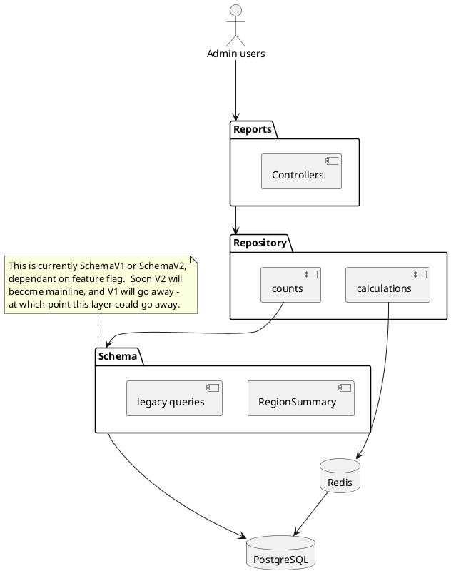

Repository architecture

```plantuml
@startuml

package "Reports" {
  [Controllers]
}

package "Repository" {
  [calculations]
  [counts]
}

package "Schema" {
  [RegionSummary]
  [legacy queries]
}
note top of Schema
  This is currently SchemaV1 or SchemaV2,
  dependant on feature flag.  Soon V2 will
  become mainline, and V1 will go away -
  at which point this layer could go away.
end note

database "Redis" {
}

database "PostgreSQL" {
}

:Admin users: ---> Reports
Reports --> Repository
counts --> Schema
Schema --> PostgreSQL
calculations ---> Redis
Redis --> PostgreSQL

@enduml
```

