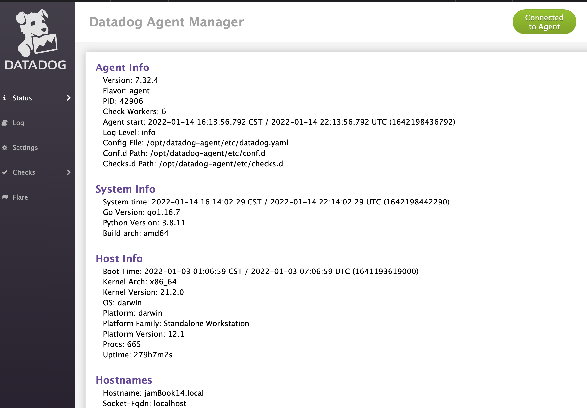

# HOWTO Run DataDog locally

We depend on Datadog for much of our performance and health metrics of simple-server, as well as some increased usage to monitor performance of simple-android. It can be _very_ useful to run Datadog locally with your local server if you are working on fine-tuning configuration or setting up more advanced instrumentation of traces. This is pretty easy to do, here's how:

1. Install the datadog-agent locally - make sure you are logged into our Datadog account, and follow the instructions here (for Mac)

https://app.datadoghq.com/account/settings#agent/mac
 
As long as you are logged in, that will install an agent on Mac already configured with our API key. Pay attention to the docs about the agent running at login -- you probably don't want that, as it would be constantly sending your dev metrics to DD. You can disable that with the system tray agent DD installs, and then manually start/stop via 

```
datadog-agent start
datadog-agent stop
```

2. Verify the agent is running locally by visiting http://127.0.0.1:5002 - you should see a page that looks something like this:



1. You'll want to modify the datadog.conf to set the `env` flag to `development` at a minimum. Otherwise your DD info will be sent with no environment, which is confusing.

Open /opt/datadog-agent/datadog.yaml and find the commented out `env:` line. Uncomment and change it to the following:

```
## @param env - string - optional
## @env DD_ENV - string - optional
## The environment name where the agent is running. Attached in-app to every
## metric, event, log, trace, and service check emitted by this Agent.
#
env: development
```

This yaml file would also be where you would tweak DD agent settings to verify their impact on global tracing, sampling, etc, before diving into our deployment repo to make those changes for the servers for real.

3. Now start your services with `DATADOG_ENABLED=1`:

```
DATADOG_ENABLED=1 rails server
DATADOG_ENABLED=1 bundle exec sidekiq start
```

1. Hit your local server and access some pages, kick off some sidekiq jobs, etc.
1. Go to Datadog and view live traces for dev - you should see things streaming in that correspond 

https://app.datadoghq.com/apm/traces?query=%40_top_level%3A1%20env%3Adevelopment&cols=service%2Cresource_name%2C%40duration%2C%40http.method%2C%40http.status_code%2C%40_duration.by_service&historicalData=false&showAllSpans=false&streamTraces=true&start=1642198156765&end=1642199056765&paused=false