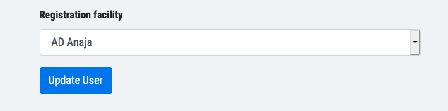

# Moving patient data for a user from one facility to another

Due to human error, there's an occasional possibility of patients being registered in the wrong facility. 

So far we've seen this happen due to:

1. Facility being soft-deleted (accidentally or intentionally)
2. Accidentally or incorrectly approving users in the wrong facility

This problem has so far presented itself in two ways:

a. The user has data locally, but cannot sync because the facility is soft-deleted (point 1. from above).  
b. The user has data locally, can sync, but is syncing to the wrong facility (point 2. from above).

Fixing b. can be automated by following these steps:

* Move user data from source facility to destination facility

```bash
bundle exec cap india:production deploy:rake task=data_fixes:move_user_data_from_source_to_destination_facility[<user-id>,<source-facility-id>,<destination-facility-id>]
```

* Reattach the user to the correct facility using the edit UI (eg. https://api.simple.org/admin/users/user_id/edit) and pick the correct registration facility from the drop down:



Fixing a. is tricky since the user's syncs would be failing (because facility is soft-deleted) and hence it'd be difficult to recover their data. We can currently only fix this manually if we deem it important enough:

* Un-delete the soft-deleted facility temporarily
  * This may also require creating a Region for this facility
  * Make sure you attach this new facility region to this facility
* Ask the user to sync the data back to this, now, undeleted facility
* Move the data into the correct facility using the aforementioned script
* Reattach the user to the correct facility using the edit UI (as described above)
* Soft-delete the facility again
